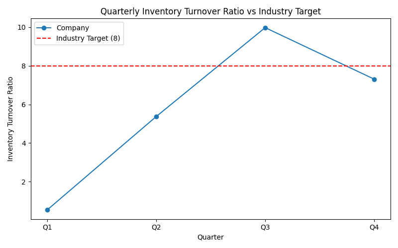

# Retail Performance Analysis

**Analyst:** 22f3000808@ds.study.iitm.ac.in  

## 📊 Key Findings
- The company’s **average inventory turnover ratio is 5.8**, which is **below the industry benchmark of 8**.  
- Q1 (0.53) was drastically low, dragging down the annual average.  
- Q3 (9.98) exceeded the benchmark, proving that higher efficiency is possible.  
- Q4 (7.31) shows partial recovery but still under target.  

## 📈 Business Implications
- Excess inventory in Q1 → significant storage costs and capital lock-in.  
- Inconsistent turnover across quarters → poor demand forecasting.  
- Lower turnover reduces profitability and competitiveness.  

## ✅ Recommendations
To achieve the **target of 8**:  
- **Optimize supply chain and demand forecasting** (core solution).  
- Implement just-in-time inventory management.  
- Strengthen supplier collaboration for flexible procurement.  
- Use predictive analytics to anticipate demand more accurately.  

## 📊 Visualization

---
